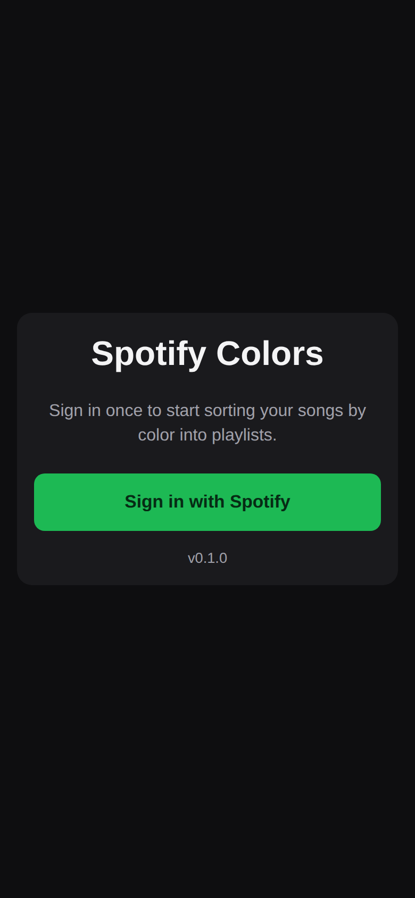
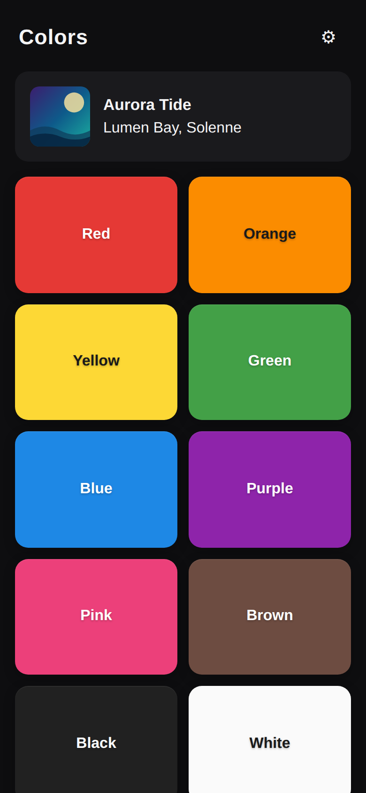
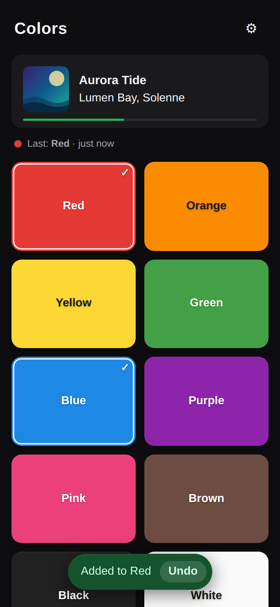
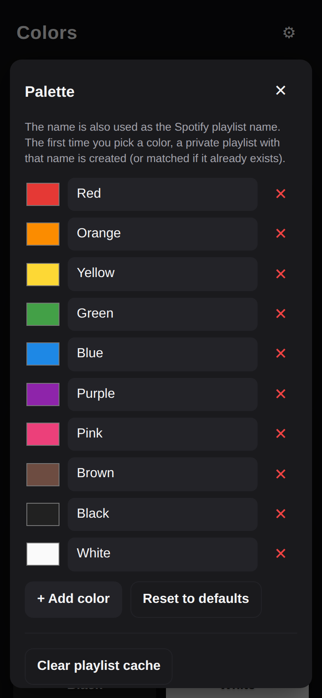
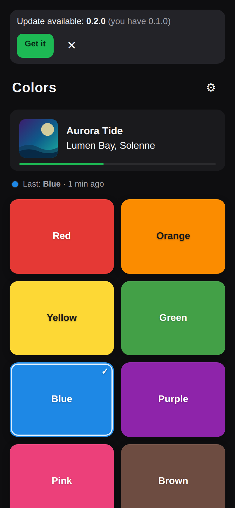
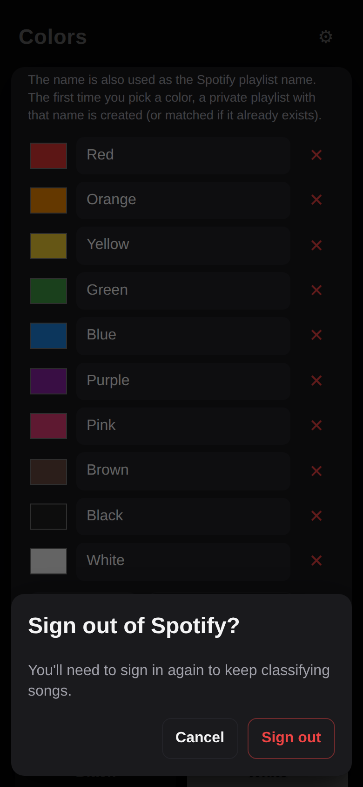

# Spotify Colors

A tiny app for classifying whatever song is playing on Spotify into a color-named
playlist. One screen: the current track on top, a grid of color buttons below.
Tap a color → the song lands in a private playlist with that color's name
(created automatically the first time).

Ships as both:
- a **PWA** (installable from any modern browser), and
- a **native Android APK** (Capacitor wrapper around the same React app, signed and sideloadable).

## Screenshots

<p align="center">
  
  
  
</p>

<p align="center">
  
  
  
</p>

<sub>Screenshots are rendered via Playwright against the live dev server with the Spotify API mocked — regenerate with <code>npm run screenshots</code> after UI changes.</sub>

## Features

- Sign in once with Spotify (OAuth PKCE — no server needed)
- "Now playing" card with live progress bar, auto-refreshes every 5s; tap to open in Spotify
- Configurable palette (rename, recolor, add, remove colors)
- Already-classified swatches show a checkmark so you never have to wonder if a song's been sorted
- "Last: Blue · 2 min ago" status line confirms the previous tap landed
- One-tap **Undo** in the post-classification toast removes the song from the playlist
- Native haptic feedback on Android color taps
- Duplicate-aware: won't add the same song twice to the same color
- In-app update check (compares against a `version.json` on your PWA host) with a direct download link
- Offline shell + cached album art via service worker
- Same React codebase for web and Android

## Spotify Developer setup (one-time)

At https://developer.spotify.com/dashboard, in **your app → Settings → Redirect URIs** add **all** of these:

| Environment | Redirect URI |
| --- | --- |
| Local web dev | `http://127.0.0.1:5173` |
| Production PWA | your deployed URL, e.g. `https://colors.yourdomain.com` |
| Android app | `com.spotifycolors.app://callback` |

Note your Client ID — you'll put it in `.env`.

## Local web setup

1. `cp .env.example .env` and fill in `VITE_SPOTIFY_CLIENT_ID`
2. `npm install`
3. `npm run generate-pwa-assets` (one-time, generates PNG icons from `public/icon.svg`)
4. `npm run dev` and open http://127.0.0.1:5173

## Deploy PWA to Cloudflare Pages

- Build command: `npm run build`
- Build output directory: `dist`
- Environment variables:
  - `VITE_SPOTIFY_CLIENT_ID`
  - `VITE_SPOTIFY_REDIRECT_URI` — your production URL (e.g. `https://colors.yourdomain.com`)

`public/_redirects` handles SPA fallback so the OAuth callback works on any URL.

## Android APK

The Android app is a Capacitor wrapper around the same React build. Same UX, real Android app icon, fullscreen, offline-capable. OAuth comes back to the app via the custom URI scheme `com.spotifycolors.app://callback`.

### Prerequisites
- JDK 17
- Android SDK with platforms `android-36` and build-tools `36.0.0`
- `ANDROID_HOME` / `ANDROID_SDK_ROOT` env var pointing to the SDK

### Debug APK (for personal sideload)

```sh
npm run android:apk:debug
# Output: android/app/build/outputs/apk/debug/app-debug.apk
```

The debug APK is auto-signed with Android's debug keystore. It installs fine via "Install unknown apps". For one-person sideload this is enough.

### Release APK (signed)

1. Generate a keystore (once):
   ```sh
   keytool -genkey -v -keystore release.keystore -alias spotifycolors \
     -keyalg RSA -keysize 2048 -validity 10000
   ```
2. Create `android/keystore.properties` (gitignored):
   ```properties
   storeFile=../../release.keystore
   storePassword=YOUR_STORE_PASSWORD
   keyAlias=spotifycolors
   keyPassword=YOUR_KEY_PASSWORD
   ```
3. Build:
   ```sh
   npm run android:apk:release
   # Output: android/app/build/outputs/apk/release/app-release.apk
   ```

### Installing on the device
- Email / AirDrop / Google Drive the APK to the device
- Tap the APK file → Android prompts "Allow this source to install apps" → done
- App icon "Spotify Colors" appears in the device's launcher

### Updating the app
After any code change:
```sh
npm run android:apk:debug   # or :release
```
Reinstall the new APK over the old one (same signing key required for release builds).

### Customizing the icon

Source SVG is `public/icon.svg`. After editing:
```sh
node -e "require('sharp')('public/icon.svg',{density:1024}).resize(1024,1024).png().toFile('assets/icon.png')"
npx capacitor-assets generate --android
npm run android:sync
```

## Release pipeline (signed APK via GitHub Actions)

The workflow at `.github/workflows/release.yml` builds and signs a release APK
on every `v*.*.*` git tag (or via the "Run workflow" button), then attaches it
to a GitHub Release. Combined with the in-app update banner, that's the full
loop for keeping the installed app up to date — the device sees the banner,
the user taps "Get it", downloads from the Release page, installs.

### One-time setup

1. **Generate a release keystore** locally (only once, ever):
   ```sh
   keytool -genkey -keystore release.keystore -alias spotifycolors \
     -keyalg RSA -keysize 2048 -validity 10000
   ```
   Store the file and both passwords in a password manager. **If you lose
   them, no future update will install over the current app** — the user
   would have to uninstall first, losing tokens, palette, and classifications.

2. **Base64-encode the keystore** so it can live in a GitHub Secret:
   ```sh
   base64 -w0 release.keystore > release.keystore.b64
   ```

3. **Add Repository Secrets** under Settings → Secrets and variables →
   Actions → New repository secret:

   | Secret | Value |
   | --- | --- |
   | `RELEASE_KEYSTORE_BASE64` | Paste the entire contents of `release.keystore.b64` |
   | `KEYSTORE_PASSWORD` | Store password you set with `keytool` |
   | `KEY_PASSWORD` | Key password (often the same as the store password) |
   | `KEY_ALIAS` | Optional — defaults to `spotifycolors` |
   | `VITE_SPOTIFY_CLIENT_ID` | Same value as your local `.env` |
   | `VITE_SPOTIFY_REDIRECT_URI` | Production PWA URL |
   | `VITE_UPDATE_CHECK_URL` | URL where `version.json` is hosted |
   | `VITE_UPDATE_DOWNLOAD_URL` | Usually `https://github.com/<you>/<repo>/releases/latest` |

   Delete the local `release.keystore.b64` after pasting it — keep only the
   raw `.keystore` and the passwords.

### Each release

1. Bump `version` in `package.json` (e.g. `0.1.0` → `0.2.0`)
2. Commit, push to main → Cloudflare Pages auto-deploys the PWA and the
   updated `version.json`
3. Tag and push:
   ```sh
   git tag v0.2.0
   git push --tags
   ```
4. Workflow runs (~5 min): decodes the keystore, builds the web bundle and
   the signed APK with `versionName=0.2.0` and a monotonically increasing
   `versionCode`, verifies the signature, creates the GitHub Release with
   auto-generated notes, attaches `spotify-colors-0.2.0.apk`.
5. The device opens the app → fetches `version.json` → sees the new version →
   banner appears → the user taps "Get it" → downloads the APK from the Release
   page → installs.

### Trust note

Anyone with write access to the repo (or to the secrets above) can produce
APKs that Android will accept as updates to the installed app. Keep the
collaborator list small.

## Architecture

- `src/spotify/auth.ts` — PKCE flow, token storage, refresh. Detects native platform and uses `com.spotifycolors.app://callback` + `@capacitor/app` deep-link listener instead of `window.location` redirect.
- `src/spotify/api.ts` — currently-playing, playlist resolve/create, add track. Duplicate detection.
- `src/hooks/useNowPlaying.ts` — polling hook (pauses when tab is hidden).
- `src/lib/palette.ts` — default colors + persistence.
- `src/components/` — UI only, no Spotify calls.
- `capacitor.config.ts` — bundle ID `com.spotifycolors.app`, web dir `dist`.
- `android/` — generated Android project, manifest contains the `com.spotifycolors.app://callback` intent filter.

State lives in `localStorage`:
- `sc.tokens.v1` — access + refresh tokens
- `sc.palette.v1` — user's color palette
- `sc.playlists.v1` — cache of `colorName → playlistId`
- `sc.user.v1` — cached Spotify user id

## Scopes used

`user-read-currently-playing`, `user-read-playback-state`, `playlist-read-private`,
`playlist-modify-private`, `playlist-modify-public`.
